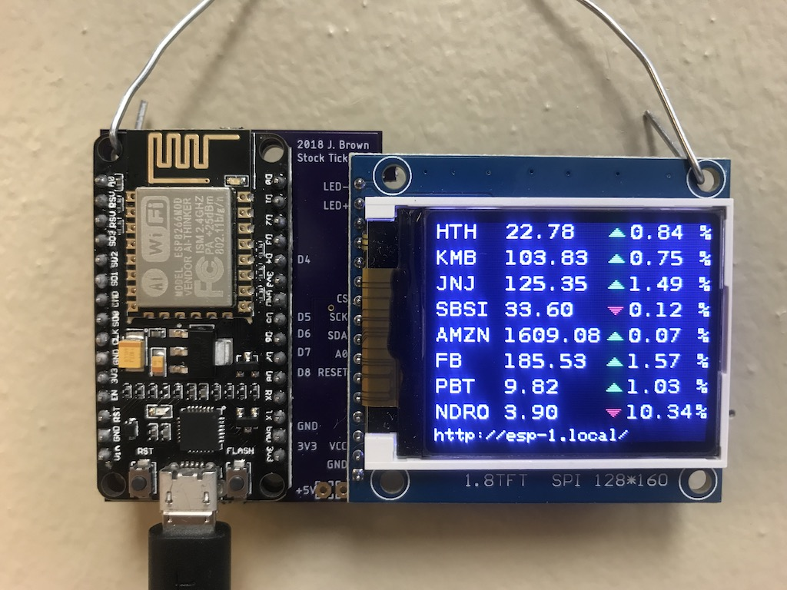
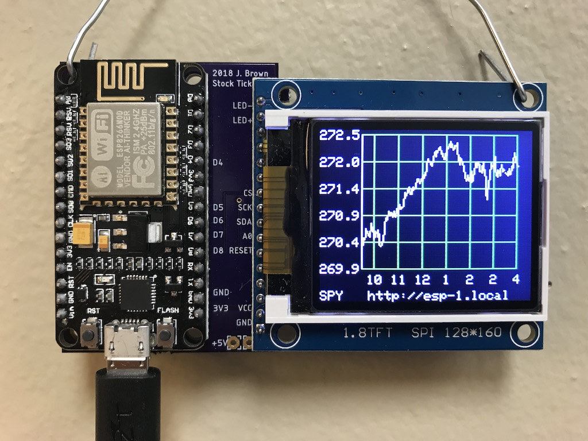
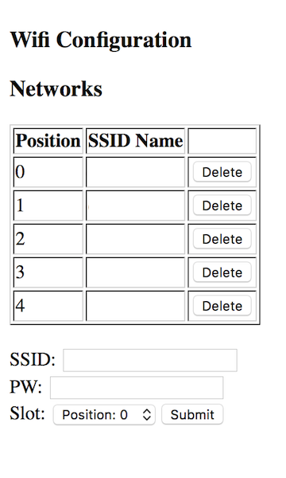

# ESPStockTicker

This project contains the necessary code to retrieve and display stock market prices for a set of stock tickers. It will also display a one day chart for a given stock ticker. 

It makes use of the following hardware:

- NodeMCU ESP8266
- ST7735 1.8 TFT 128 160 display
- A custom circuit board (Eagle files included)

The project makes use of the following libraries:

- ESP8266Wifi
- ArduinoJson
- Adafruit ST7735 graphics driver
- Adafruit GFX graphics library
- IEX Trading API for real time stock information
- Arduino OTA
- elapsedMillis

The code can be compiled in the Arduino IDE provided you have installed the board mamanger, by specifing the URL in the additional boards manager url field in preferences. Currently: [http://arduino.esp8266.com/stable/package_esp8266com_index.json]

# Setup

After compiling the source code and uploading to your ESP, you'll need to also upload the data files. You can install the very handy ESP8266 Data Upload plugin to your Arduino IDE. [https://github.com/esp8266/arduino-esp8266fs-plugin]

After the ESP restarts it will begin by looking for known WIFI networks. If it can't connect, it will go into softAP mode and create an adhoc wifi network called esp. You can connect to it and navigate to [http://esp.local/wifi]. This page will allow you to configure your wifi settings.

After you save your changes, the ESP should pick up the new settings and try to connect. Once it is connected, it will display its mDNS hostname after looking for any name collisions. You can access this URL with a browser on an mDNS aware platform (Linux, Mac OS, IOS). Generally this will be [http://esp.local]. This page will allow you to specify your stock tickers to track. The first ticker will be used to print the chart for the day. 

![EnterStocksScreenShot][enterstocks.png]

# Eagle Files

# 3D Printed Box

The design for the case is hosted here: [https://cad.onshape.com/documents/baf6f8920e0056c74aa33163/w/9b8db8e1d71b7267bfcf4cd1/e/1de548e62555208ea106f9fa]

